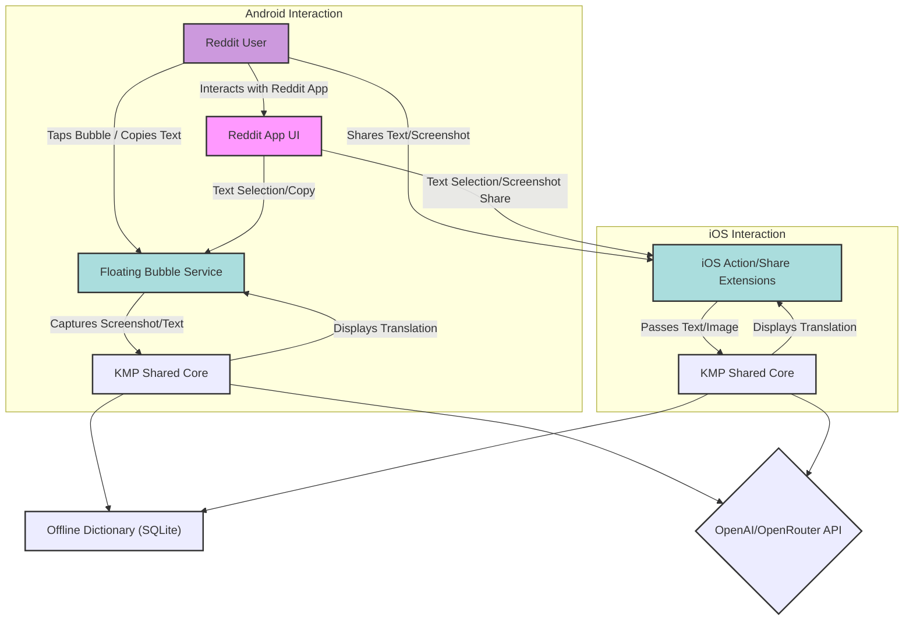
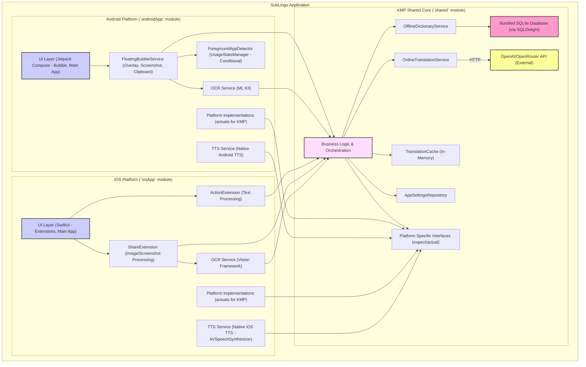

# SubLingo Architecture Document

## Technical Summary

The SubLingo mobile application provides Reddit users with instant English translation capabilities directly within the Reddit app. It leverages a Kotlin Multiplatform (KMP) core for shared business logic, including offline dictionary lookups and online sentence translation management. Platform-specific UIs are built with Jetpack Compose for Android and SwiftUI for iOS. Key architectural patterns include on-device processing for OCR (ML Kit on Android, Vision Framework on iOS) and offline dictionary access (SQLite via SQLDelight), with optional online API calls (Ktor Client) to OpenAI/OpenRouter for advanced sentence translation. The architecture prioritizes a seamless user experience with minimal disruption to Reddit Browse, while acknowledging the MVP constraint of an embedded API key for online services.

## High-Level Overview

SubLingo operates as a client-side application with no custom backend for the MVP. The primary architectural style is a mobile-first, KMP-centric approach with platform-specific UI and service integrations. Users interact with SubLingo via Android's floating bubble or iOS's Share/Action Extensions. These entry points capture text or screenshots from the Reddit app, which are then processed by the shared KMP module. The KMP module orchestrates lookups against a bundled offline dictionary or makes calls to an external online translation service. Results are then displayed back to the user through the native UI components.

## Component View

The system comprises three main logical groupings: the KMP Shared Core, the Android-specific components, and the iOS-specific components.

- **KMP Shared Core (`shared` module):**

    - **Business Logic & Orchestration:** Handles core decision-making (e.g., when to use offline vs. online translation), input processing, and coordinates calls to other services within the shared module.
    - **OfflineDictionaryService:** Manages access to the bundled SQLite dictionary, including querying for definitions and examples using SQLDelight.
    - **OnlineTranslationService:** Handles communication with the OpenAI/OpenRouter API via Ktor for sentence translation. Manages the embedded API key.
    - **TranslationCache:** In-memory LRU cache for both offline word lookups and online sentence translations to reduce redundant processing/API calls.
    - **AppSettingsRepository:** Manages user-configurable settings (e.g., toggle for online translation) using Multiplatform-Settings.
    - **Platform Specific Interfaces (expect/actual):** Defines contracts for functionalities that need native implementations (e.g., TTS, showing native UI elements from shared code if needed, accessing file system for bundled dictionary).

- **Android Platform (`androidApp` module):**

    - **UI Layer (Jetpack Compose):** Provides the user interface for the main application settings screen and the floating bubble content.
    - **FloatingBubbleService:** Manages the lifecycle of the floating bubble, handles screen overlay permissions, captures screenshots for OCR, manages clipboard interactions, and initiates translation requests to the KMP core.
    - **ForegroundAppDetector (Conditional):** Uses `UsageStatsManager` to detect if Reddit is the foreground app, to auto-show/hide the bubble (this is a high-friction permission feature).
    - **OCR Service (ML Kit):** Implements on-device text recognition from images using Google's ML Kit.
    - **TTS Service (Native Android TTS):** Provides text-to-speech functionality using Android's native TTS engine.
    - **Platform Implementations (actuals):** Provides concrete Android implementations for `expect` declarations from the KMP `shared` module.

- **iOS Platform (`iosApp` module):**

    - **UI Layer (SwiftUI):** Provides the user interface for the main application settings screen and the UIs presented by the Action and Share Extensions.
    - **ActionExtension:** Handles selected text shared from other apps (e.g., Reddit). Passes text to the KMP core for translation.
    - **ShareExtension:** Handles images/screenshots shared from other apps. Performs OCR using the Vision Framework and passes extracted text to the KMP core.
    - **OCR Service (Vision Framework):** Implements on-device text recognition from images using Apple's Vision Framework.
    - **TTS Service (Native iOS TTS):** Provides text-to-speech functionality using `AVSpeechSynthesizer`.
    - **Platform Implementations (actuals):** Provides concrete iOS implementations for `expect` declarations from the KMP `shared` module.

## Key Architectural Decisions & Patterns

-   **Kotlin Multiplatform (KMP) for Shared Core:**
    * **Decision:** Utilize KMP for all shareable business logic, including dictionary services, online translation API interactions, caching, and settings management.
    * **Justification:** Mandated by PRD, leverages existing `SubLingo` project, promotes code reuse, and allows for consistent logic across Android and iOS platforms. Reduces development effort for common functionalities.
-   **Native UI per Platform:**
    * **Decision:** Employ Jetpack Compose for Android UI and SwiftUI for iOS UI.
    * **Justification:** Mandated by PRD. Ensures the most authentic platform look, feel, and performance. Allows deep integration with platform-specific features like Android's Floating Bubble and iOS's App Extensions.
-   **Offline-First for Word Definitions:**
    * **Decision:** Bundle a "lite" English dictionary (SQLite) within the app, accessible via SQLDelight from the KMP core.
    * **Justification:** Core functional requirement (FR3, PRD). Provides instant translations for single words without internet dependency, enhancing usability and speed for basic lookups. (Story 2.1, 2.2)
-   **On-Device OCR:**
    * **Decision:** Use ML Kit Text Recognition on Android and Vision Framework on iOS for OCR.
    * **Justification:** Mandated by PRD (FR2). Keeps image processing on-device, enhancing privacy and enabling offline OCR capabilities (though the primary use case is quick capture and translation, often online). (Story 3.2, 3.5)
-   **API Key Embedded in Client (MVP Constraint):**
    * **Decision:** The API key for OpenAI/OpenRouter will be embedded in the application code for the MVP.
    * **Justification:** Explicitly chosen due to the "no custom backend" constraint for MVP, despite the acknowledged high security risk. This decision will be flagged with risk mitigation advice. (User decision, PRD constraint)
-   **Platform-Specific Interaction Models:**
    * **Decision:**
        * Android: Floating Bubble service for overlay translation, clipboard monitoring, and screenshot capture.
        * iOS: Action Extension for selected text, Share Extension for screenshots/images.
    * **Justification:** Leverages platform strengths and common user interaction patterns for in-app translation assistance. (FR1, FR2, Epics 1 & 3)
-   **In-Memory Caching for Translations:**
    * **Decision:** Implement a simple in-memory LRU cache (e.g., `LinkedHashMap`) in the KMP core for recent offline word lookups (Story 2.7) and online sentence translations (Story 4.6).
    * **Justification:** Improves perceived performance for repeated queries and reduces redundant API calls for online translations, saving costs and potentially speeding up responses.
-   **Asynchronous Operations with Coroutines:**
    * **Decision:** Utilize Kotlin Coroutines extensively in the KMP core and platform-specific modules for all I/O-bound operations (networking, file access, database queries, OCR processing).
    * **Justification:** Ensures a responsive, non-blocking UI and efficient resource management. Standard practice in modern Kotlin development.
-   **`expect`/`actual` for Platform-Specific Implementations:**
    * **Decision:** Use KMP's `expect`/`actual` mechanism for features requiring native implementations but invoked from shared code (e.g., TTS, accessing bundled dictionary path, specific UI interactions if any). (Story 1.7)
    * **Justification:** Standard KMP pattern for bridging shared logic with native platform capabilities.

## Infrastructure and Deployment Overview

-   **Cloud Provider(s):** N/A (No custom backend for MVP). Online translation relies on third-party OpenAI/OpenRouter APIs.
-   **Core Services Used:** N/A (No custom backend for MVP).
-   **Infrastructure as Code (IaC):** N/A (No custom backend for MVP).
-   **Deployment Strategy:**
    * Android: Standard Google Play Store deployment (manual uploads of AAB/APK for MVP).
    * iOS: Standard Apple App Store deployment (manual uploads via Xcode/Transporter for MVP).
    * CI/CD: Desirable post-MVP. For MVP, builds and deployments will be manual. (PRD: "CI/CD pipeline setup is desirable but may be deferred post-MVP")
-   **Environments:**
    * Development: Local developer builds via Android Studio / Xcode.
    * Production: App Store releases.
    * (No distinct staging environment with backend components for MVP).

(See `docs/environment-vars.md` for client-side configuration details, primarily for the API key placeholder)
(See `docs/coding-standards.md` for detailed coding patterns and error handling)

## Key Reference Documents

-   `docs/prd.md` (Product Requirements Document)
-   `docs/project-analysis.md` (Project Analysis Document)
-   `docs/epic1.md` (Core App Setup & Platform Integration Framework)
-   `docs/epic2.md` (Offline Word Translation Feature)
-   `docs/epic3.md` (OCR-Based Comment Translation Feature)
-   `docs/epic4.md` (Online Sentence Translation Feature)
-   `docs/epic5.md` (Onboarding & Settings)
-   `docs/epic6.md` (Polish, Error Handling, and Privacy)
-   `docs/tech-stack.md` (Technology Stack - *to be created*)
-   `docs/project-structure.md` (Project Structure - *to be created*)
-   `docs/coding-standards.md` (Coding Standards and Patterns - *to be created*)
-   `docs/api-reference.md` (API Reference - *to be created, focusing on OpenAI/OpenRouter*)
-   `docs/data-models.md` (Data Models - *to be created*)
-   `docs/environment-vars.md` (Environment Variables - *to be created*)
-   `docs/testing-strategy.md` (Testing Strategy - *to be created*)
-   `docs/privacy-policy.md` (Privacy Policy - *content to be finalized, placeholder for now*)

## Change Log

| Change        | Date       | Version | Description                                      | Author   |
| :------------ | :--------- | :------ | :----------------------------------------------- | :------- |
| Initial draft | 2025-05-15 | 0.1     | First draft based on PRD, analysis, and epics. | Architect Agent |
